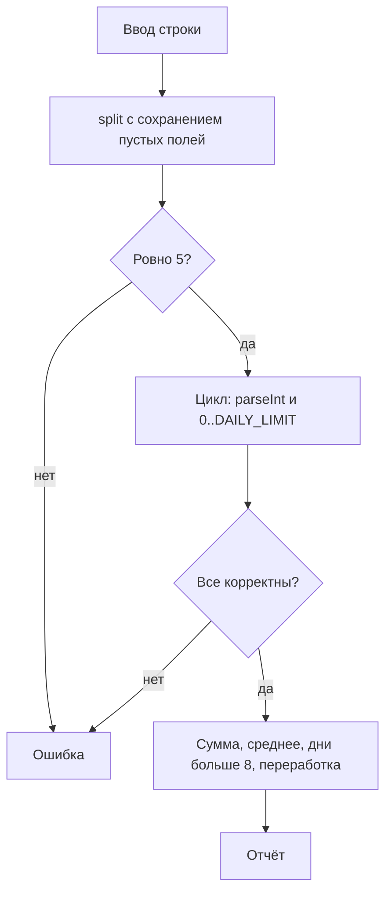

# Activity-диаграмма

```mermaid
flowchart TD
 A[Ввод строки] --> B[split с сохранением пустых полей]
 B --> C{Ровно 5?}
 C -- нет --> E[Ошибка]
 C -- да --> D[Цикл: parseInt и 0..DAILY_LIMIT]
 D --> F{Все корректны?}
 F -- нет --> E
 F -- да --> G[Сумма, среднее, дни больше 8, переработка]
 G --> H[Отчёт]
```
