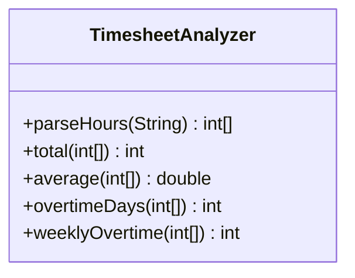

# Диаграмма классов

```mermaid
classDiagram
 class TimesheetAnalyzer {
 +parseHours(String) int[]
 +total(int[]) int
 +average(int[]) double
 +overtimeDays(int[]) int
 +weeklyOvertime(int[]) int
 }
```
