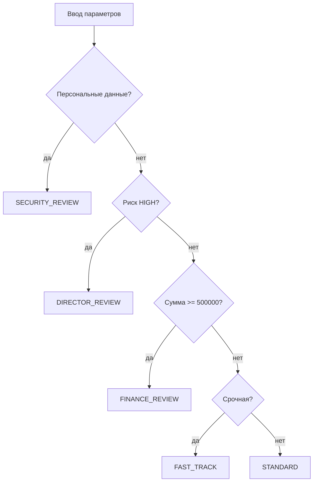

# Activity-диаграмма

```mermaid
flowchart TD
 A[Ввод параметров] --> B{Персональные данные?}
 B -- да --> S[SECURITY_REVIEW]
 B -- нет --> C{Риск HIGH?}
 C -- да --> D[DIRECTOR_REVIEW]
 C -- нет --> E{Сумма >= 500000?}
 E -- да --> F[FINANCE_REVIEW]
 E -- нет --> G{Срочная?}
 G -- да --> H[FAST_TRACK]
 G -- нет --> I[STANDARD]
```
