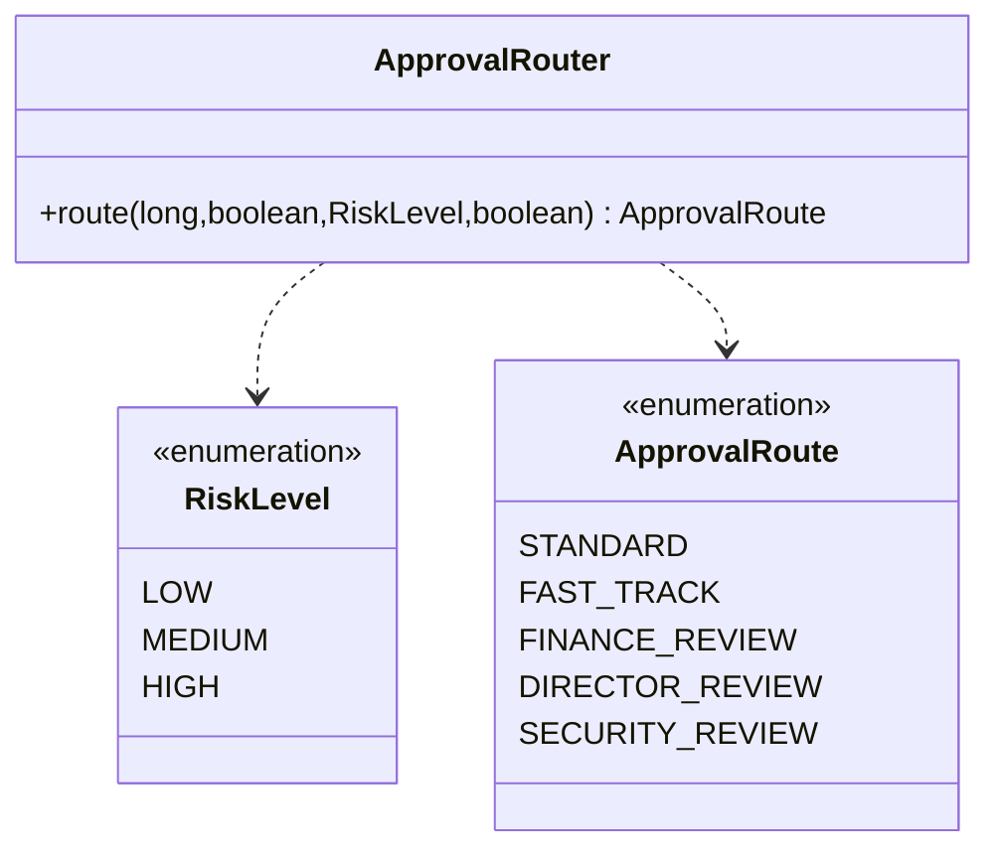

# Диаграмма классов

```mermaid
classDiagram
 ApprovalRouter ..> RiskLevel
 ApprovalRouter ..> ApprovalRoute
 class ApprovalRouter {
 +route(long,boolean,RiskLevel,boolean) ApprovalRoute
 }
 class RiskLevel {
 <<enumeration>>
 LOW
 MEDIUM
 HIGH
 }
 class ApprovalRoute {
 <<enumeration>>
 STANDARD
 FAST_TRACK
 FINANCE_REVIEW
 DIRECTOR_REVIEW
 SECURITY_REVIEW
 }
```
