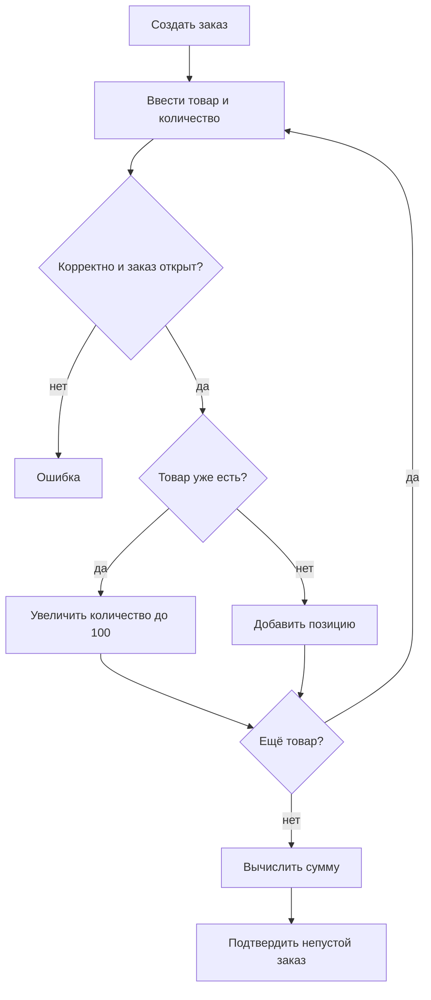

# Activity-диаграмма

```mermaid
flowchart TD
 A[Создать заказ] --> B[Ввести товар и количество]
 B --> C{Корректно и заказ открыт?}
 C -- нет --> X[Ошибка]
 C -- да --> D{Товар уже есть?}
 D -- да --> E[Увеличить количество до 100]
 D -- нет --> F[Добавить позицию]
 E --> G{Ещё товар?}
 F --> G
 G -- да --> B
 G -- нет --> H[Вычислить сумму]
 H --> I[Подтвердить непустой заказ]
```
