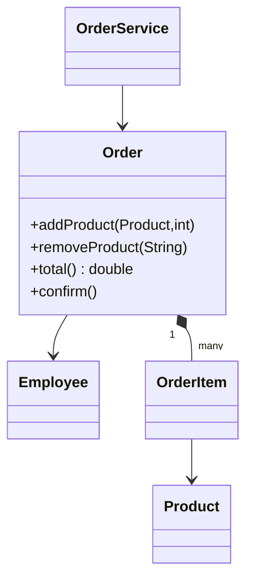

# Диаграмма классов

```mermaid
classDiagram
 OrderService --> Order
 Order --> Employee
 Order "1" *-- "many" OrderItem
 OrderItem --> Product
 class Order {
 +addProduct(Product,int)
 +removeProduct(String)
 +total() double
 +confirm()
 }
```
