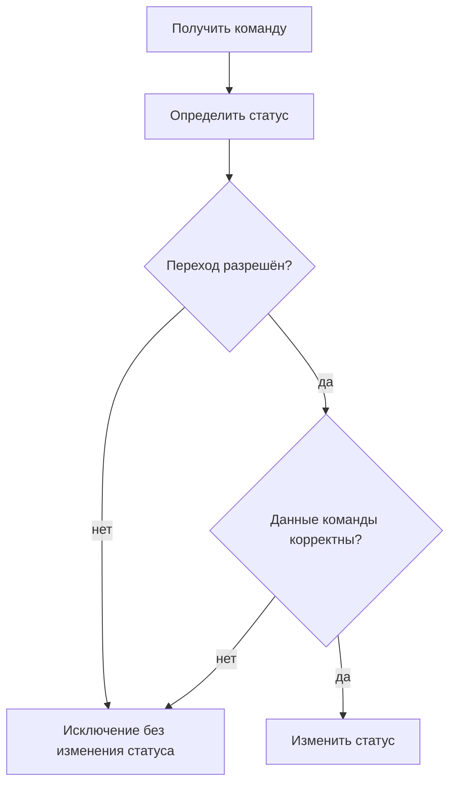

# Activity-диаграмма

```mermaid
flowchart TD
 A[Получить команду] --> B[Определить статус]
 B --> C{Переход разрешён?}
 C -- нет --> E[Исключение без изменения статуса]
 C -- да --> D{Данные команды корректны?}
 D -- нет --> E
 D -- да --> F[Изменить статус]
```
