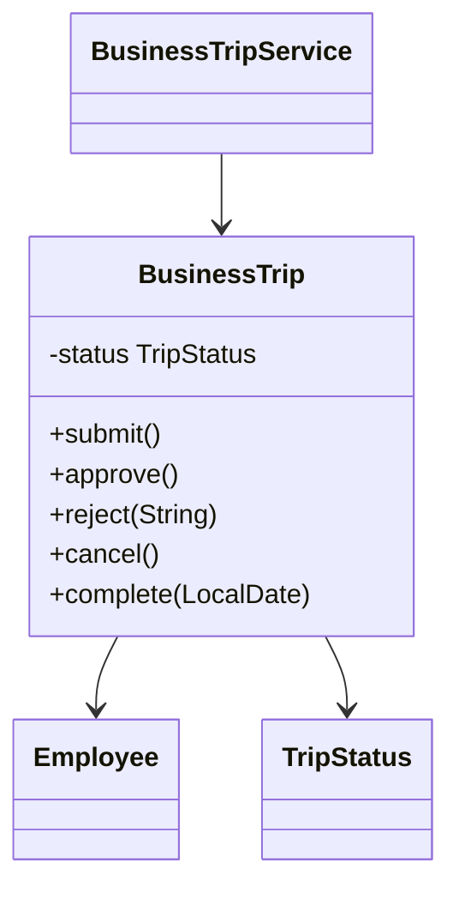

# Диаграмма классов

```mermaid
classDiagram
 BusinessTripService --> BusinessTrip
 BusinessTrip --> Employee
 BusinessTrip --> TripStatus
 class BusinessTrip {
 -status TripStatus
 +submit()
 +approve()
 +reject(String)
 +cancel()
 +complete(LocalDate)
 }
```
